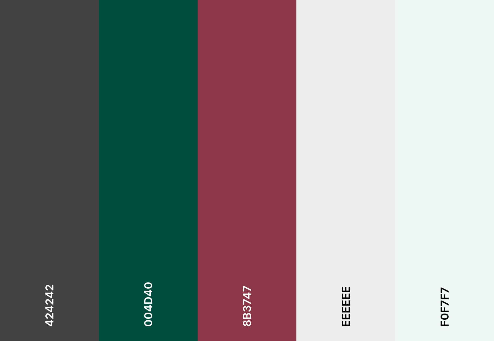

# FoodWise
**FoodWise**  is a website developed from the idea of my journey as a parent to children with food allergies. It was hard to come by for recipes that were allergen free and easily accessible online. 
Allergy Wise Food is a recipe sharing and management application where caregivers of children with food allergies can create, share, edit and delete their ideas for recipes. 

I have designed the website to be user friendly as its main focus. It is designed to be fully responsive and accessible on a range of devices.  

**Link to website** [here](https://stran90.github.io/).

## Table Of Contents:
1. [Design & Planning](#design-&-planning)
    * [User Stories](#user-stories)
    * [Wireframes](#wireframes)
    * [Typography](#typography)
    * [Colour Scheme](#colour-scheme)
    * [Database Diagram](#database-diagram)
    
2. [Features](#features)
    * [Navigation](#Navigation-bar)
    * [Footer](#footer)
    * [Home page](#home-page)
    * [add your pages](#)
   

3. [Technologies Used](#technologies-used)
4. [Libraries](#libraries-used)
5. [Testing](#testing)
6. [Bugs](#bugs)
7. [Deployment](#deployment)
8. [Credits](#credits)
9. [Acknowledgment](#acknowledgment)

## Design & Planning:

### User Stories

- A parent/care giver looking for recipes not containing one or more of the top 14 common food allergens to cook for their family. 
- Any one looking for inspiration for a recipe to cook, that are free from top one or more of the top 14 food allergens. 

#### First-time Visitor Goals 
- As a first time user, I want to see short information about the main purpose of the site, how to use the site. 
- As a first time user, I want to look through recipes. 
- As a first time user, I want to be able create/login an user account. 

#### Registered User Visitor Goals
- As a registered user, I want to be able to add, edit and delete own recipes.  
- As a registered user, I want to be able to upload images to my recipes. 
- As a registered user, I want to be able to add recipes based on categories. 


#### Site Owner Goals
- As the site owner, I want users to quickly know what FoodWise is offering.
- As the site owner, I want have the ability to maintain editing or deleting categories. 
- As the site owner, I want the add, edit or delete own recipes. 
- As the site owner I want delete any recipes by other users. 

### Wireframes
For all page wireframes, please see [WIREFRAMES.md](WIREFRAMES.md) file.

### Typography
- [Google Fonts](https://fonts.google.com/)

  - Used 'Roboto': "light 300" font for the website as it great for accessibility.

### Colour Scheme
<p align="center">
  
</p>

The website uses a contrast of colours, I wanted to choose colours to have good contrast and look professional. 

### DataBase Diagram
The project employs a non-relational database model, which implies that each collection is not interconnected in the same way as in a relational database. Consequently, when a document in one collection required referencing a document in another collection, special handling was necessary. 

The project being a data-centric project, I aimed for a comprehensive planning phase concerning the data to be stored in the database, the interlinking of each document, and the user interaction on the frontend, encompassing complete CRUD operations. I documented detailed plans to guide the development of Python logic and relevant forms effectively.

#### Image of the database diagram for the project:

Users:

```
{
    _id: ObjectId,
    user_id: integer,
    f_name: string,
    l_name: string,
    email: string,
    username: string,
    password: hashed password,
}
```

Recipes:

```
{
    _id: ObjectId
    recipe_name: string,
    recipe_description: string,
    category_name: category_name (from categories)
    ingredients: [
        "Ingredient 1", 
        "Ingredient 2",
        "Ingredient 2",
    ],
    "preparations": [
        "Step 1",
        "Step 2", 
        "Step 3", 
    ],
    "cook _time": integer,
    "serves": Integer,
    "created_by": "username": (from user),
}
```

## Features:
Explain your features on the website,(navigation, pages, links, forms, input fields, CRUD....)
## Technologies Used
List of technologies used for your project (Languages, Tools...)
## Testing
Important part of your README!!!
### Google's Lighthouse Performance
Screenshots of certain pages and scores (mobile and desktop)
### Browser Compatibility
Check compatability with different browsers (Firefox, Edge, Chrome)
### Responsiveness
Screenshots of the responsivness, pick few devices
### Code Validation
Validate your code HTML, CSS, JS & Python - display screenshots
### Manual Testing user stories
Test all your user stories, you an create table 
User Story |  Test | Pass
--- | --- | :---:
paste here you user story | what is visible to the user and what action they should perform | &check;
- attach screenshot
### Manual Testing features
Test all your features, you can use the same approach 
| Status | feature
|:-------:|:--------|
| &check; | description
- attach screenshot
## Bugs
List of bugs and how did you fix them, you can create simple table
| Bug | Fix
|:-------:|:--------|
|   |    |
## Deployment
This website is deployed to Heroku from a GitHub repository, the following steps were taken:

#### Creating Repository on GitHub
- First make sure you are signed into [Github](https://github.com/) and go to the code institutes template, which can be found [here](https://github.com/Code-Institute-Org/gitpod-full-template).
- Then click on **use this template** and select **Create a new repository** from the drop-down. Enter the name for the repository and click **Create repository from template**.
- Once the repository was created, I clicked the green **gitpod** button to create a workspace in gitpod so that I could write the code for the site.
  
#### Making a Local Clone
- write steps

#### Forking the Github Repository 
- write steps

#### Creating an app on Heroku
- After creating the repository on GitHub, head over to [heroku](https://www.heroku.com/) and sign in.
- On the home page, click **New** and **Create new app** from the drop down.
- Give the app a name(this must be unique) and select a **region** I chose **Europe** as I am in Europe, Then click **Create app**.

#### Deploying to Heroku.
- In GitPod CLI, the root directory of the project, run: pip3 freeze --local > requirements.txt to create a requirements.txt file containing project dependencies.
- In the Gitpod project workspace root directory, create a new file called Procfile, with capital 'P'. Open the Procfile. - Inside the file, check that web: python3 app.py has been added when creating the file Save the file.
- Push the 2 new files to the GitHub repository
- Login to Heroku, select Create new app, add the name for your app and choose your closest region.
- Navigate to the Deploy tab on Heroku dashboard and select Github, search for your repository and click 'connect'.
- Navigate to the settings tab, click reveal config vars and input the following:


| Key | Value
|:-------:|:--------|
| DATABASE_URL  |    |
| IP  |    |
|  PORT |    |
|  SECRET_KEY   |     |

Actual Enviroment variables not disclosed for security
## Credits
List of used resources for your website (text, images, snippets of code, projects....), add links and description
## Acknowledgment
Mention people who helped you with your project(mentor, colleagues...)