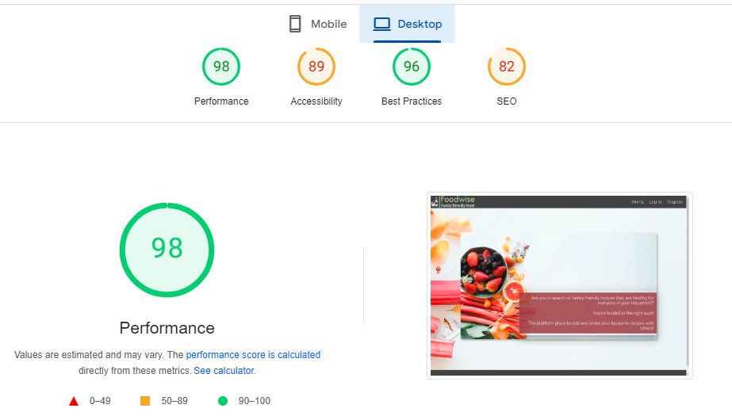

# Testing
I conducted manual testing throughout the project development, ensuring that each component was thoroughly tested as it was implemented. To inspect code and its effect on the rendered site simultaneously, I utilized Google Chrome DevTools in the browser.

### Google's Lighthouse Performance
Google Chrome Dev Tools Lighthouse function to check the performance, accessibility and search engine optimization with scores documented below.

#### Desktop

  

#### Mobile

  

### Browser Compatibility

I've personally tested the website on Android and Windows laptops, and everything is displaying correctly. Additionally, I've asked friends and family to access it on Macs and other devices, and they have confirmed that it works well for them too.

### Responsiveness
Website is fully responsive, with use of 4 breakpoints:

- 375px - mobile size,
- 768px - tablet size,
- 1440px - desktop size,
- 1950px - desktop large size.

### Code Validation

### HTML

I used [W3 HTML Validator](https://validator.w3.org/) to validate all HTML files by URI, pasting each page into the address bar and checking to ensure no errors were found. After changing one section element to a div and removing the trailing / from an img tag, all sites received no errors.

### Manual Testing user stories

* Home Page Desktop view

  

* Home Page Mobile view

  

- As a first time user I can see with the information in the homepage what the site is about. Home, login and register links can be seen in the navigation bar. 
- The mobile view, the navigation bar is changed to 3 small bars for better user experience. 

* Register Page 

  

- A form is present to sign up to the site. First name, last name, email, username, and password inputs are seen. As well with a cancel and register button. 
- Below the buttons is a link for the user if they have mistaken the wrong click and is already registers they can click on to the link to be redirected to the login page. 

  

  

  

  

  

  

- When filling the form, the above images show the tooltip working as it should, if a input field is not filled in, the field is let known to the user. 
- If username or email have been used, the user is alerted with a flask messge of "Username or email already exists". 

-When form is filled correctly, the user is registered and redirected to the login page as seen below with a Flask message "Registration successful". 

  

* Profile Page 

  

- When the user logins with the correct creditials, the user is directed to their profile page. Their first name, last name, email and username are stored here by the site. 

* Categories Page 

  

- Card panels of added categories can be seen. With edit/delete button and the name and decription of the category is seen. 

  

- A form is seen when category name and decription input field is provided for the user. Along with a cancel and add category buttons. 

  

- When user clicks add category, they are redirected to the categories page and will see that their category had been made and appears on the page. 

  

- If the user chooses to edit a category they just click on the edit button and get redirected to the edit category page. Where there is a edit category button. 
- If user goes and edits the description and clicks on the button, the site will redirect the user to the categories page and with the updated description seen in the category Vegetables.  

  

  

- If user wanted to delete category, a confirmation to delete it will come up when the user clicks on delete. This helps with accidental clicks. 

- If the user does want to continue with deletion, then the category is deleted from the site, user is redirected with the updated categories page. Where they will see the category is no longer there. 

* Recipes Page

  

- When the user locates to the recipe page, recipe cards can be seen. An image is seen on the recipe and the stock image that is rendered if user does not paste a URL link can be seen on two recipe cards.  
- The user can not see and edit or delete buttons on the recipe cards as they do not have access to edit/delete recipes that have not been posted by them. 

- Use can see basic recipe info such as description, serves and cooking time, who posted it. This is see if the image or three dots are clicked on. 

  

* Add Recipe

### Manual Testing features
Test all your features, you can use the same approach 
| Status | feature
|:-------:|:--------|
| &check; | description
- attach screenshot

## Manual Testing

## User Stories

### First time user

### Registered user
|

## Code Validators

### HTML

W3 HTML Validator (https://validator.w3.org/) to validate all HTML files by URI, 

### CSS

W3 CSS Validator (https://jigsaw.w3.org/css-validator/validator) to validate the style.css file and 

### Python

Code Institue Python Linter (https://pep8ci.herokuapp.com/)

 

[Back to README](README.md)