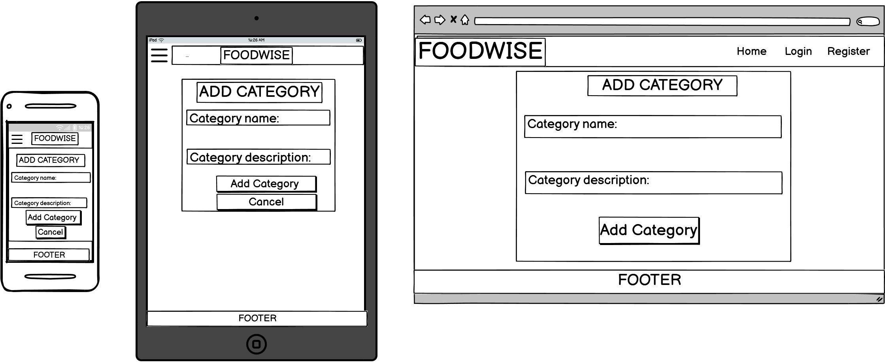

# Wireframes

All wireframes were created using [Balsamiq](https://balsamiq.com/)

## Home

## Register

## Login

## Profile

## Recipes

## Add Recipes

## Categories

## Add Category

Back to [README](README.md)